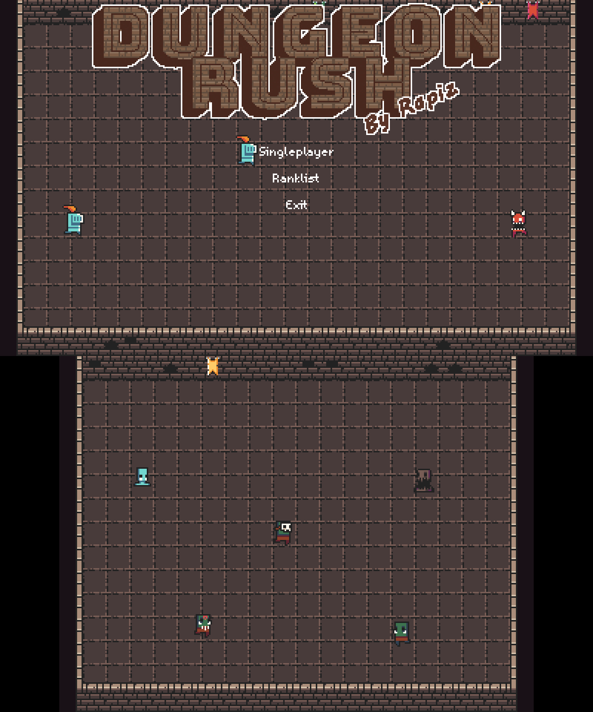
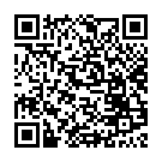

# DungeonRush

>A game inspired by Snake, in pure C with SDL2.

This is a port for 3ds!

## Download

Easiest way to download is scanning this QR code with [FBI](https://github.com/steveice10/FBI)  

[Installable](https://github.com/PurpleStingray/DungeonRush/releases/download/release/DungeonRush.cia)

[Homebrew](https://github.com/PurpleStingray/DungeonRush/releases/download/release/DungeonRush.3dsx)

For all other builds please download from [the original author's github](https://github.com/yujqiao/DungeonRush)

## Release Notes

### v1.0
- Runs on 3ds
- GPU acceleration
- camera to allow full sized map on 3ds
- added minimap
- removed multiplayer
- all other features from v1.1 beta

## How to Play

Use C-stick or D-pad to move.

Collect heros to enlarge your army while defending yourself from the monsters. Each level has a target length of the hero queue. Once it's reached, you will be sent to the next level and start over. There are lots of stuff that will be adjusted according to the level you're on, including factors of HP and damage, duration of Buffs and DeBuffs, the number and strength of monsters and so on.

### Weapons

There are powerful weapons randomly dropped by the monsters. Different kinds of heros can be equipped with different kind of weapons.

*My favorite is the ThunderStaff. A cool staff that makes your wizard summon thunder striking all enemies around.*

### Buff/DeBuff

There's a possibility that the attack from one with weapon triggers certain Buff on himself or DeBuff on the enemy.

- IceSword can frozen enemies.
- HolySword can give you a shield that absorbs damage and makes you immune to DeBuff.
- GreatBow can increase the damage of all your heros' attack.
- And so on.

For sure, some kinds of monsters have weapons that can put a DeBuff on you! *(Like the troublesome muddy monsters can slow down your movement.)*

## Build
I recommend using the included build script

## AI disclosure 
I used sonnet v4 and deepseek v4.1 flash extensively during the making of this port. 

## License and Credits
DungeonRush has mixed meida with 
various licenses. Unfortunately I failed to track them all. In other word, there are many stuff excluding code that comes with unknown license. You should not reuse any of audio, bitmaps, font in this project. If you insist, use at your own risk.
### Code
GPL
### Bitmap
|Name|License|
|----|-------|
|DungeonTilesetII_v1.3 By 0x72|CC 0|
|Other stuff By rapiz|CC BY-NC-SA 4.0|
### Music
|Name|License|
|----|-------|
|Digital_Dream_Azureflux_Remix By Starbox|CC BY-NC-SA 4.0|
|BOMB By Azureflux|CC BY-NC-SA 4.0|
|Unknown BGM|Unknown|
|The Essential Retro Video Game Sound Effects Collection By Juhani Junkala |CC BY 3.0|
